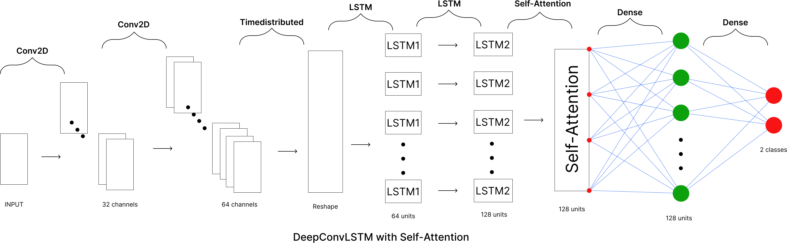
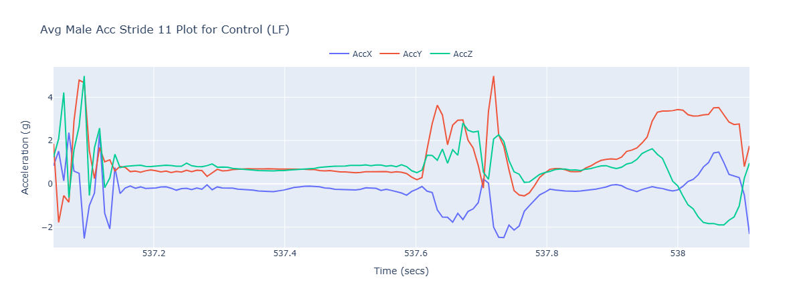

## Fatigue Detection

This project utilizes **IMU signals** from passive walking in order to detect **physical fatigue**.

### Overview

This project uses a novel hybrid deep learning model known as **DeepConvLSTM with Self-Attention** in order to classify fatigue labels. In addition, we investigate the various signals in the training set and understand the distributions of various participants.

### Model

-   **Single Head Dot-Product Self-Attention** to identify key time steps after **LSTM** layers

### Dataset

-   Public Gait Dataset for walking under **Fatigue** and **Control** Conditions
-   Provides IMU sensor data from **18 participants** with **6 minute walks**
-   Various sensors placed at diverse locations recording **IMU signals**
-   Source: [DUO-GAIT: A gait dataset for walking under dual-task and fatigue conditions with inertial measurement units](https://pubmed.ncbi.nlm.nih.gov/37604913/)

### Feature Visualization + Selection

-   Utilized the **left foot sensor** located above the foot instep
-   Selected **accelerometry** + **gyroscope** based IMU signals

### Preprocessing

-   3rd order **Butterworth filter** to smooth out sensor noise with 10 Hz cutoff freq
-   **Padded** stride windows to consistent length of 150 samples
-   **Standard scale** each feature channel independently based on training set

### Results

-   **91% F1-Score** using the **1D-CNN Baseline** Architecture
-   **97% F1-Score** using **DeepConvLSTM with Self-Attention** Architecture

### Future Ideas

-   Investigate left out participant approach for model generalization to **unseen participants**
-   Explore and minimize **subject variations** among IMU stride signals

### License

This project is open-source and available under the [GPL License](LICENSE).
